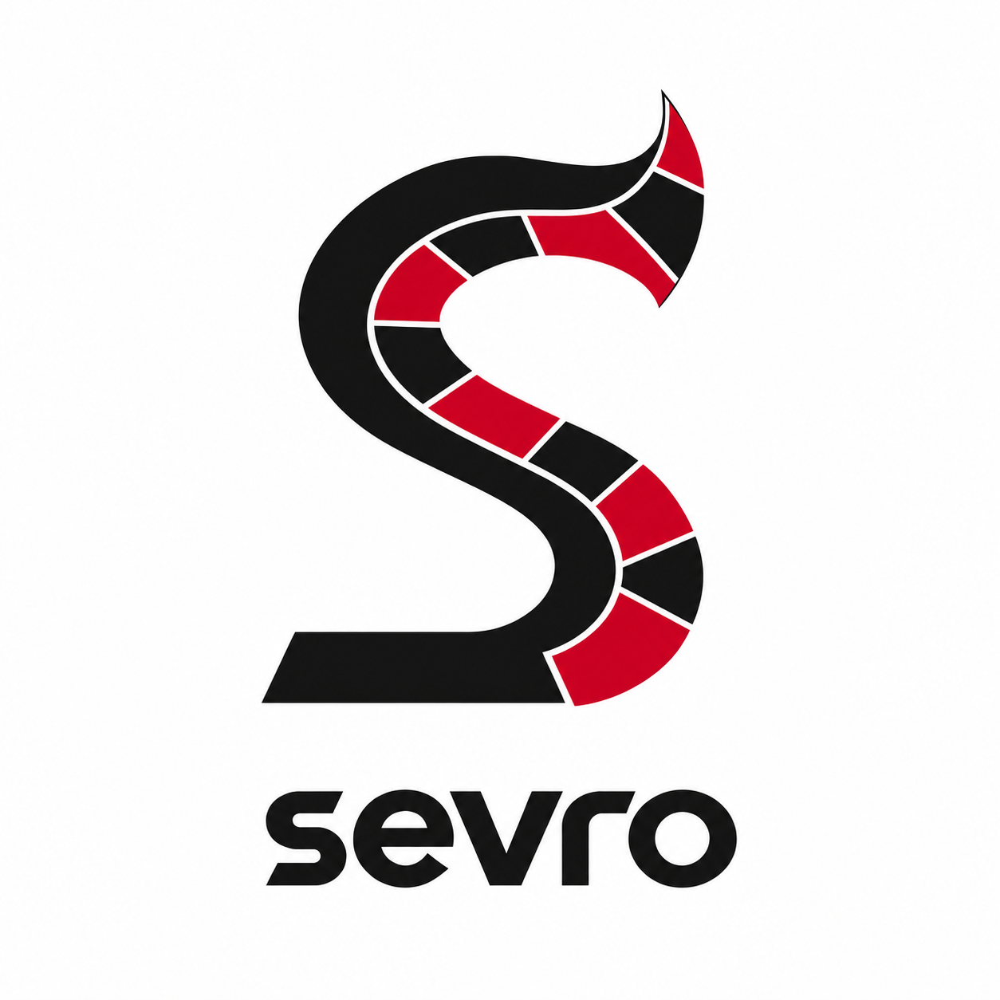

# Sevro

<p align="center">
  
</p>

Sevro runs repeatable evaluations of coding agents. Give it a case, a host
adapter, and success criteria; it retains execution, grading results, and
evidence. Projects own their benchmark cases and policy through Sevro's
[extension boundary](docs/extension-protocol-v1.md).

Sevro grew out of [Darrow](https://github.com/BjRo/darrow), but works without a
Darrow checkout. Try [your first evaluation](docs/getting-started.md): no model
account is required.

## Status and environments

Sevro is under active development. The npm package is `@bjoernrochel/sevro`;
its command is `sevro`. The [current release](docs/installing.md#current-release) includes runtime
configuration, native goals, selected plugin hooks, and the current licensing terms.
Earlier `rc.1` and `rc.2` packages retain their original BSL grants.
See [installation and release differences](docs/installing.md).

Use Bun 1.3.13. The development checkout runs native isolation on macOS with
`sandbox-exec` and on Ubuntu with `bubblewrap` and `socat`.
Contributor package/release checks also need Node 24 and npm.
Windows support is unverified. The basic example uses an injected
deterministic adapter and needs no native model credentials.

## Install and get a first result

```sh
mkdir sevro-demo
cd sevro-demo
bun init -y
```

Install the [current release](docs/installing.md#current-release) in that directory.
Continue with [your first evaluation](docs/getting-started.md): the exact command,
expected `passed` result, and retained evidence. Read [installation](docs/installing.md)
for updates, removal, and source checkouts.

## Find your next task

The [documentation hub](docs/README.md) routes to running evaluations, authoring
cases and extensions, reading results, troubleshooting, and architecture.
Public v1 contracts are the [extension protocol](docs/extension-protocol-v1.md),
[results and evidence](docs/results-v1.md), and [report](docs/report-v1.md).
Machine-readable contracts live in [schemas/](schemas/).

## Ask the repository guide

Open this checkout in a fresh Codex or Claude Code session and ask
“What is Sevro, and how do I run my first evaluation?” Explicit invocation is
`$sevro-guide` in Codex or `/sevro-guide` in Claude Code.
The guide reads sources, cites its answers, and handles follow-ups. It explains
commands; execution requires a separate request. See the
[guide contract and verification limits](docs/specs/repository-guide.md).
The npm package does not install the repository guide.

## Contribute

[CONTRIBUTING.md](CONTRIBUTING.md) covers setup, checks, fixtures, schema
regeneration, compatibility, and releases. [Documentation quality](docs/documentation-quality.md)
defines documentation checks and review.

Run `bun run check:typescript` for the complete quality gate and
`bun run check:typescript --fast` before committing. The
[TypeScript quality contract](docs/typescript-quality.md) defines the source
inventory, strict typing, property tests, coverage integrity, and supported
environment.

## License and acknowledgements

The [current release](docs/installing.md#current-release) uses the [Sevro Source Available License 1.0](LICENSE).
Use is free in every context, including commercial work and paid education.
Selling copies, rebranded versions, or hosted access to Sevro's functionality
requires a separate license. Modification and free redistribution remain allowed.
It is source-available, not an OSI open-source license. Read
[licensing](docs/licensing.md) for contribution grants and earlier BSL releases.

Björn Rochel created the logo. Sevro's name is inspired by the character in
Pierce Brown's _Red Rising_. Thank you, Pierce Brown, for the world and characters
that inspired both Sevro and Darrow. See [acknowledgements](docs/acknowledgements.md).
